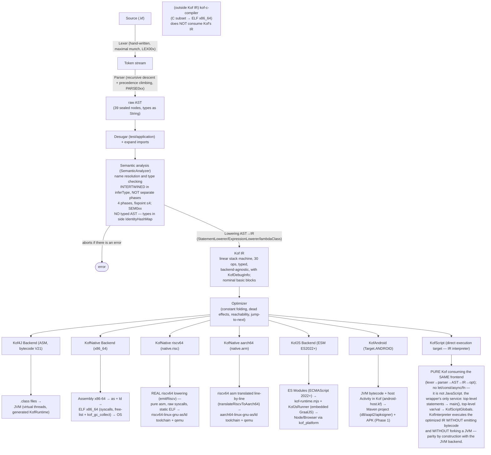
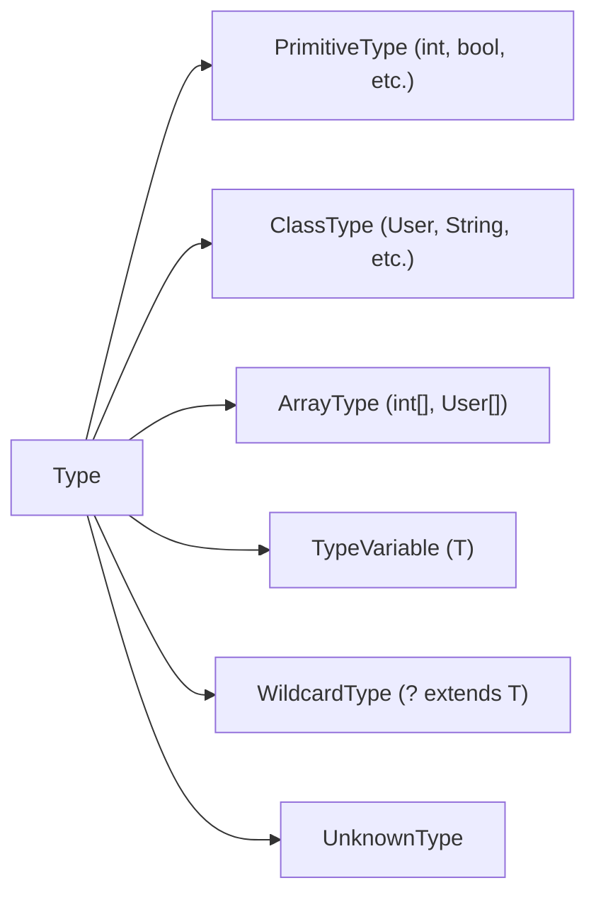
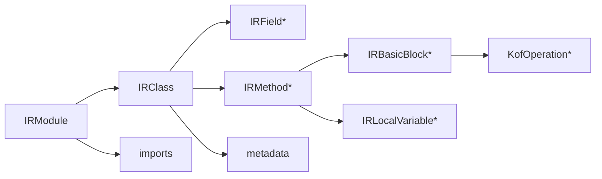
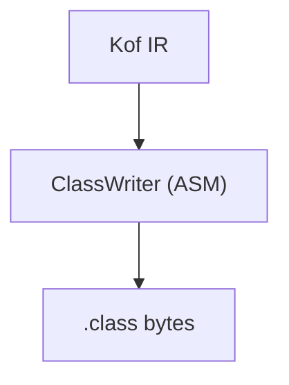
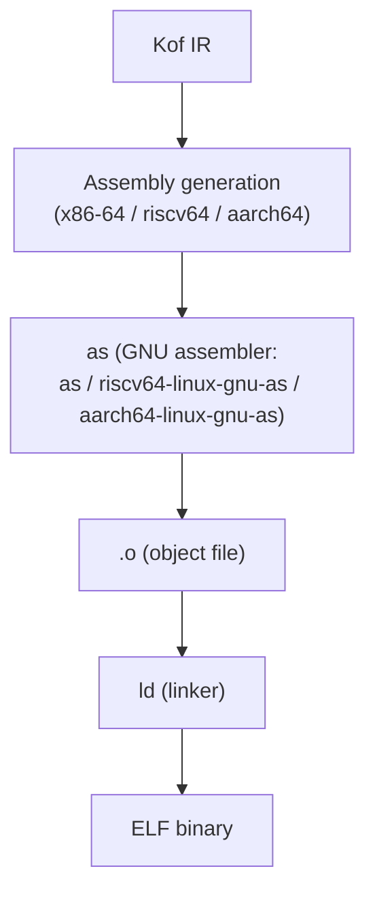
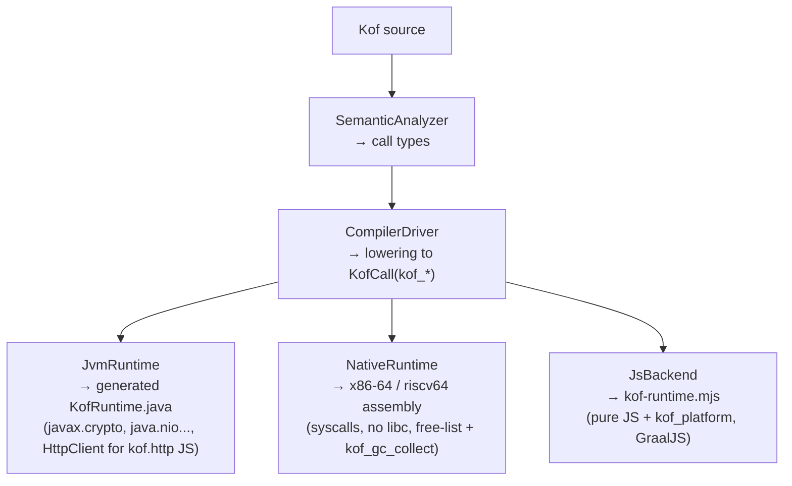

[English](architecture.md) | [Português](architecture.pt_BR.md)

# Architecture Decision Record

## Project: Kof

## Status: Accepted

**Last updated:** September 13, 2026
**Version:** 0.4.0-beta

> **Visual improvement 13/09 (issue #109):** the ASCII diagrams of this ADR
> (Pipeline, Type Representation, IR, backends and stdlib dispatch) became
> **Mermaid** — GitHub renders them natively; content and facts unchanged
> (only the notation). Terminal blocks (e.g. diagnostics example) remain
> `text`.

> **This ADR records the architectural decision (multi-target via shared
> frontend + pluggable backends).** The **complete and current** description
> of the compiler implementation (real pipeline, IR, lowering, optimizations,
> backends, targets, terminology) is in
> [`compiler-architecture.md`](compiler-architecture.md). The **language
> specification** (independent of this implementation) is in
> [`language-reference/`](../language-reference/).
>
 > **Corrections 06/09 (audit):** (a) riscv64 and aarch64 are **no** longer
 > "x86_64 placeholder" — riscv64 has real lowering (`NativeBackend.emitRiscv`)
 > and aarch64 is translated from riscv64 (`translateRiscvToAarch64`); (b) **KofC**
 > does not consume Kof's IR (C subset → ELF); **KofScript consumes the SAME
 > frontend** (lexer→parser→AST→IR) and executes the optimized IR in the interpreter
 > (direct execution target, 0.4.0-beta); (c) the IR is a **linear stack
 > machine** (30 ops), not a "tree". See SG-E1/SG-E3 in
 > [`specification-gaps.md`](../bugs-and-gaps/specification-gaps.md).

## Context

Kof is a statically typed, object-oriented programming language. The compiler must generate code for multiple targets from a single IR.

One language. One compiler. Multiple targets.

## Pipeline



## Decision: Multiplatform via Shared Frontend + Pluggable Backends

### Rationale

1. **One language, multiple targets.** The same Kof source compiles to JVM, native, script, or web.
2. **Shared frontend.** Lexer, parser, AST, type system, and semantic analysis are shared across all backends.
3. **Pluggable backends.** Each target has its own backend that consumes the same IR.
4. **No transpilation.** Kof generates bytecode directly for JVM, assembly for native.
5. **No Java intermediate.** Kof does not generate Java source code.

### Backend Interface

```java
public interface Backend {
    void emit(IRModule module, Path outputDir) throws IOException;
}
```

Implementations:
- `JvmBackend` - generates `.class` files via ASM (`kof-compiler/src/main/java/dev/kof/compiler/jvm/JvmBackend.java:1`)
- `NativeBackend` - generates ELF via assembly + `as` + `ld` (x86_64 stable, riscv64/aarch64 via cross toolchain)
- `JsBackend` - generates ES Modules (ECMAScript 2022+), executed by the embedded GraalJS engine (`KofJsRunner`)
- `KofCCompiler` - C subset (`kof c`) → ELF x86_64 native-only (`kof-c-compiler/src/main/java/dev/kof/c/KofCCompiler.java:1`)

### Target Enum

```java
public enum Target {
    JVM,
    NATIVE,          // x86_64 stable (free-list + kof_gc_collect, pthread spawn 31/08)
    NATIVE_RISCV64,  // native.risc: real riscv64 lowering (NativeBackend.emitRiscv) + riscv64 toolchain + qemu
    NATIVE_AARCH64,  // native.arm: translation from riscv64 (translateRiscvToAarch64) + aarch64 toolchain + qemu
    JS,              // alpha (GraalJS)
    ANDROID          // Phase 1: Maven project + APK (JVM bytecode + host Activity in Kof)
}
```

CLI: `kof build/run --target jvm|native|native.risc|native.arm|js` (aliases `native.riscv64`/`native.aarch64`; `android` in Phase 1) (`CompilerDriver.java:1`, `Target.java:1`). `kof run`/`kof build --target js` executes JS without Node.js (embedded runtime). `kof c` uses `KofCCompiler` only for `native`.

## Type System

The type system supports (0.4.0-beta, re-synced 17/09/2026):

- Primitive types: `bool`, `byte`, `short`, `int`, `long`, `float`, `double`, `char`
- Reference types: classes, interfaces, enums (with `values()/valueOf` + exhaustiveness), records
- Generic types: `List<T>`, `Map<K,V>`, `Set<T>`, `Box<T>` (erasure, `Box<Int>` works via `substituteTypeVariable` `CompilerTypes.java:423`)
- Type parameters: `<T>` (implemented, erasure); bounds (future)
- Wildcards: `?`, `? extends T`, `? super T` (future)
- Arrays: `int[]`, `String[]`
- Null safety: `String?` basic (`Type?` nullable, compile-time `?`-check) — since 0.2.6-beta
- Pattern matching: `switch` with `case String s` + record destructuring `Point(x,y)` — JVM/Native/JS (since 0.2.6-beta)
- Void type
- Function types: `FunctionType` (lambdas with captures via `BoxN`, implemented)

### Type Representation



## IR

The IR is a backend-agnostic lowered representation of the AST.



### KofOperation types

- **Literals**: KofLoadLiteral (int, long, float, double, string, bool, null)
- **Variables**: KofLoadLocal, KofStoreLocal
- **Fields**: KofLoadField, KofStoreField, KofGetStatic, KofPutStatic
- **Arithmetic**: KofBinary (ADD, SUB, MUL, DIV, MOD), KofUnary (NEG, NOT)
- **Comparisons**: KofConditionalJump (EQ, NE, LT, LE, GT, GE)
- **Control flow**: KofLabel, KofJump, KofConditionalJump
- **Calls**: KofCall (INSTANCE, STATIC, CONSTRUCTOR, FUNCTION)
- **Object creation**: KofNewObject
- **Return**: KofReturn, KofReturnVoid
- **Stack**: KofDup, KofPop
- **Type ops**: KofCheckCast, KofInstanceOf
- **Arrays**: KofArrayLoad, KofArrayStore, KofNewArray, KofArrayLength
- **Exception**: KofThrow

### Labels

Labels use `LabelId` (integer-based), not ASM Labels.

```java
record LabelId(int id) { ... }
```

Each backend maps LabelId to its own representation (ASM Label for JVM, assembly labels for native).

## JVM Backend

The JVM backend uses ASM to generate class files.



The backend produces:
- Correct constant pool
- Correct method descriptors
- StackMapTable
- LineNumberTable (debugging)
- LocalVariableTable (debugging)

JVM Runtime (`KofRuntime` generated; base 30-31/08, re-synced 17/09): web stack
(`web.app()`, routes, middleware, `status`/`headerSet`), **WebSocket**
(`app.ws`, RFC 6455 handshake + frame codec with mask) and **SSE**
(`sse.send/event/close`), `kof.cache` (get/set/ttl/delete/clear), `kof.http`
client with **retry/circuit breaker** (`KOF_HTTP_RETRIES`/`KOF_HTTP_TRIPS`/
`KOF_HTTP_FAILURES`/`KOF_HTTP_OPEN_UNTIL`, 30s window, fail-fast),
`KofRuntime.close` (closing ws descriptors).

## Native Backend

The native backend generates ELF binaries (0.4.0-beta).



Targets (0.4.0-beta, re-synced 17/09):
- `native` (x86_64) **stable**: ELF x86_64, syscalls, free-list allocator (`kof_free_head`; mark-sweep implemented 03/09, manual `kof_gc_collect_now` — auto-GC disabled, auto-collect on exhaustion pending §260; `munmap` fallback), strings/lists/JSON (objects/records + FP arrays, 31/08), exceptions with unwinding, `spawn`/`await` via `pthread_create` + trampoline + `pthread_join` with thread-safe allocator (futex) — CONC001 (31/08), real FP in XMM (`vcvtsi2sd`/`mulsd`, dtoa via `snprintf`) — FLT001, `kof_db_mysql_scramble` + wire protocol in progress
- `native.risc` (riscv64) **real**: riscv64 lowering (`NativeBackend.emitRiscv`); `riscv64-linux-gnu-as/ld` + qemu
- `native.arm` (aarch64) **real**: translation from riscv64 (`translateRiscvToAarch64`); `aarch64-linux-gnu-as/ld` + qemu

Current capabilities (x86_64):
- Record structs with fields, constructors, accessors, inheritance 3 levels, virtual dispatch via vtable
- Integer arithmetic, bitwise, real floating-point in XMM (`vcvtsi2sd`/`mulsd`), control flow (if/else, while/for/do-while/break/continue, switch with pattern matching)
- Function calls (all forms), lambdas with captures (`BoxN`), exceptions (unwinding), `spawn`/`await` with threads (pthread, 31/08)
- Strings, arrays, `List<T>` with `map/filter/reduce`, `Map<K,V>`, `Set<T>`, `Box<T>` (`kof_int_to_string`), JSON objects/records + arrays (Int/Long/Bool/String/Double, 31/08)
- `kof.io`, `kof.time` (now/sleep), `kof.config` (own asm, `/proc/self/environ`), `kof.log` (asm), `kof.security` (SHA-256/HMAC asm), `kof.cache` (30/08 — register clobber fixed), `kof.db` SQLite (direct `.so`) + MySQL wire protocol (SHA-1 scramble, WIP)

Runtime functions (x86-64, `NativeRuntime.java:1`):
- `kof_alloc` / `kof_free_head` free-list (mmap reuse) / `kof_gc_collect` (mark-sweep implemented 03/09)
- `kof_print` / `kof_println` / `kof_print_int` / `kof_int_to_string`
- `kof_string_*`, `kof_array_*`, `kof_list_*`, `kof_map_*`, `kof_cache_*`, `kof_db_mysql_scramble`
- trampoline of `pthread_create` + `pthread_join` (spawn/await, 31/08)
- `kof_panic`, `kof_null_error`, `kof_bounds_error`

## JsBackend

- Generates ES Modules, executed by embedded GraalJS (`KofJsRunner`) — no Node.js required
- Supports pattern matching (`case String s` + `Point(x,y)` via `typeof` + destructuring), `String?` basic, `kof.http` via `Java HttpClient` interop (+ fetch fallback; retry/circuit in parity with the JVM, 30/08), `List map/filter/reduce`, `Box<T>` via `substituteTypeVariable`
- Scheduler `kof.time` via `setInterval` (27/08); `spawn`/`await` with real async/await/Promise (statement/expression; CONC003 closed 03/09)
- Status alpha (0.4.0-beta)

## KofCCompiler

- C subset compiler (`kof c` — native-only): `int` globals, `void` funcs, `if`/`while`/`*(int*)`/`&`, → ELF x86_64 via `kof_c` (`KofCCompiler.java:1`)

## KofScript Runtime

KofScript is a **direct execution target**: pure Kof executed by the
IR interpreter, with no compilation step and no JVM fork
(0.4.0-beta). **It is not JavaScript** — `let`/`const`/`async`/`fn` do not
exist; they fail with the normal Kof parser diagnostic.

```bash
kof run program.kf
kof script app.kf [--watch]
kof repl
```

Implementation:
- Same frontend as the compiler (lexer→parser→AST→semantics→lowering→optimized
  IR) via `CompilerDriver.interpret(...)`
- `KofInterpreter` executes the IR as a stack machine over real JDK values;
  Kof classes become interpreted `KofObj`; builtins without lambda are
  dispatched to the generated `KofRuntime` — **parity by construction** with the
  JVM backend (same IR)
- `var`/`val` at top-level desugars to `KofScriptGlobals` fields
  (Kof has no top-level variable — the wrapper's only service)
- Compiled path (`runFileCompiled`) remains as a fallback and is
  used in parity tests; JS/Native remain on the compiled path
- Cleans up temp files; `--watch` re-executes on change; SIGPIPE handled on Windows

## Standard Library (compile-time dispatch)

Kof's Standard Library is implemented as **compile-time dispatch
tables** (docs/stdlib/stdlib.md): each module is a descriptor in the compiler
(`KofIo.java`, `KofWeb.java`, `KofSecurity.java`, `KofUi.java`) that maps the
programmer's intent to `kof_*` runtime functions:



Target gaps produce **clear compile-time diagnostics** (SECN00x,
CONC001, JSN00x, DB001, CONF001, LOG001) — never silently different behavior.

Modules (0.4.0-beta, re-synced 17/09): `kof.core`, `kof.collections` (`List map/filter/reduce`, `Map/Set`, `Box<T>`), `kof.io`, `kof.time` (scheduler `every` JVM+JS via `setInterval`), `kof.json` (objects/records + arrays on the 3 targets, 31/08), `kof.http` (JVM+JS via HttpClient; retry/circuit breaker 30/08), `kof.web` (routes/middleware + WebSocket/SSE JVM, 30/08), `kof.cache` (3 targets, 30/08), `kof.security`, `kof.concurrent` (`spawn` — JVM virtual threads, Native pthread 31/08, JS sequential), `kof.test`, `kof.cli` (18 commands: `build/run/serve/check/test/script/repl/c/fmt/config/bench/profile/inspect/debug/info/lsp/install/version`), `kof.db`/`kof.orm` (native SQLite `.so` + MySQL wire protocol WIP), `kof.config`/`kof.log`. Full state in docs/stdlib/stdlib.md and docs/status.md (current suite count).

## Diagnostics

All errors point to the original source location.

```text
error: type mismatch
  --> src/main/kf/User.kf:12:5
   |
12 |     name = 42
   |     ^^^^ expected String, found Int
```

## Java Interoperability

The JVM backend must generate bytecode that is fully compatible with Java:

- Correct class file format
- Correct method signatures
- Correct generic erasure
- Standard class loading
- Standard reflection

## Risks

| Risk | Impact | Mitigation |
|------|--------|------------|
| ASM version compatibility | High | Pin ASM version, test with target JDK |
| Generic erasure complexity | High | Start simple, add complexity incrementally |
| Debugging metadata | Medium | Generate source mapping from day one |
| Native backend complexity | High | Start with minimal ELF generation |
| KofJS complexity | High | Focus on backend first, UI model later |
| IR design | High | Keep IR simple, evolve incrementally |
