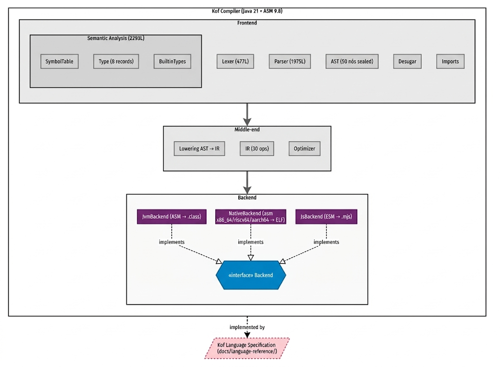

[English](compiler-architecture.md) | [Português](compiler-architecture.pt_BR.md)

# Kof Compiler Architecture

**Version:** 0.4.0-beta · **Evidence:** `kof-compiler/src/main/java/dev/kof/compiler/`

This document describes **how the Kof compiler implements the language**. It is
**normative about the implementation**, not about the language — the language
rules are in [language-reference/](../language-reference/). If this
architecture changes (refactoring, new backend), the **language does not change**.

---

## 1. Overview

**Related Maven modules:**

| Module | Role |
|---|---|
| `kof-compiler` | The compiler (frontend + middle-end + backends) |
| `kof-runtime` | Auxiliary Java classes (KofRuntime, KofHttp, KofDb, …) — **not** used by the JVM backend (see §5.1) |
| `kof-cli` | CLI `kof` (build/run/test/fmt/script/serve/debug/lsp) |
| `kof-script` | KofScript (`.ks`, REPL) — **direct execution target**: pure Kof on the SAME frontend, executed by the `KofInterpreter` (IR) without compiling |
| `kof-c-compiler` | C subset compiler → Native — **does not** consume the Kof IR |

---

## 2. Real pipeline (exact order)

`CompilerDriver.compileSources` (`:141-323`):

`text
1. Lexer.tokenize()                    → List<Token>
2. Parser.parse()                      → CompilationUnitNode (raw AST)
3. CompilerImports.expandKofImports()  → AST (directory imports resolved)
4. BuiltinTypes.registerEnum()         → global enum registry
5. CompilerDesugar.desugarTests()      → AST (test blocks → harness)
6. CompilerDesugar.desugarApplication()→ AST (application → wrapped main)
7. [ANDROID] appendAndroidHostIfNeeded → AST (+android-host.kf)
8. SemanticAnalyzer.analyze()          → AST + side maps (types, methods)
   ├── preDeclareType                  (phase 1)
   ├── defineMembers                   (phase 2)
   ├── analyzeDeclaration              (phase 3, fixpoint ≤4 per class)
   └── resolveMethodCalls              (phase 4, effective no-op)
9. [aborts if diagnostics.hasErrors()]
10. LabelId.reset()
11. lowerToIR()                        → IRModule
12. applySuperBridges()                → IRModule (override bridges)
13. [if optimizeEnabled] Optimizer.optimize() → IRModule
14. selectBackend(target)              → Backend
15. backend.emit(irModule, outputDir, debugInfo)
16. [ANDROID] AndroidProjectWriter.write()
`

**No step is a separate "type checking"** — type checking is
intertwined with name resolution inside `inferType` (step 8). See
[language-reference/type-system.md](../language-reference/type-system.md) §2.

---

## 3. Frontend

### 3.1 Lexer (`Lexer.java`)

Hand-written, single-pass, maximal munch with 1–3 character lookahead.
Produces `List<Token>`; each `Token` has `type, value, file, line, column,
offset, length`. Errors: `LEX001`–`LEX007`. The lexical grammar (what the
language defines) is in
[language-reference/lexical-structure.md](../language-reference/lexical-structure.md).

### 3.2 Parser (`Parser.java`)

Recursive descent with precedence-climbing for binaries (`parseBinary(minPrec)`,
`:1298`). Arbitrary lookahead via `check`/`checkNext`/scans (`looksLike*`).
It is **not** LL(1) nor PEG nor generated. Errors: `PARSE0xx`.

The parser produces a **raw** AST — types are `String`, unresolved. The
conversion to the "final" (desugared) AST happens in steps 5–6 of the pipeline.

### 3.3 AST (`AstNodes.java`)

`sealed interface AstNode { SourcePosition position(); }` with 50 nodes (53 records).
**There is no typed AST**: nodes do not carry a resolved type. Types live in the
analyzer's side `IdentityHashMap`s.

### 3.4 Desugaring (`CompilerDesugar.java`)

- `desugarTests`: `test "name" { … }` blocks become synthesized functions +
  execution harness (`kof test` mode).
- `desugarApplication`: `application { onStart {…} onShutdown {…} }` becomes
  synthesized functions that wrap the user's `main` (prologue/epilogue).

### 3.5 Imports (`CompilerImports.java`)

`expandKofImports(unit, moduleRoot, …)`: for each `import a.b`, if `a/b/` is a
**directory** in the module root, it **pulls all `.kf` files from that directory**
into the unit (fixpoint ≤256 rounds). This is how files of the same package see
each other.

### 3.6 Semantic analysis (`SemanticAnalyzer.java`)

Four phases (`analyze`, `:89-106`):

1. **`preDeclareType`** — creates an empty `ClassSymbol` per type; registers
   `knownClasses`; synthesizes `values()/valueOf()/name()` on enums.
2. **`defineMembers`** — fills fields/methods/constructors; record accessors;
   `TypeParameterSymbol`.
3. **`analyzeDeclaration`** — analyzes bodies; **fixpoint ≤4 passes per class**
   (return inference `void→T` via `MethodSymbol.setReturnType`).
4. **`resolveMethodCalls`** — **effective no-op** (the real resolution already
   happened eagerly in `inferType`). Structural vestige.

**Side maps** (`:64-69`): `knownClasses`, `expressionTypes`,
`resolvedMethods`, `resolvedConstructors`, `classMemberScopes`.

**Symbols** (`SymbolTable.java`): `ParameterSymbol`, `TypeParameterSymbol`,
`LocalVariableSymbol`, `FieldSymbol`, `MethodSymbol` (with mutable
`returnType`), `ConstructorSet`, `ConstructorSymbol`, `ClassSymbol`,
`FunctionSymbol` (never instantiated). `DispatchKind {INSTANCE, STATIC,
INTERFACE}`.

---

## 4. Middle-end

### 4.1 IR (`IRNodes.java`)

**IR type**: **linear stack machine** — not three-address, not SSA, not a
tree. Optimizer Javadoc (`Optimizer.java:14-15`): *"The IR is a linear,
stack-based op stream with label ops; every backend consumes it in that same
order."*

**Hierarchy**:

`text
IRModule(name, classes, imports, sourceName)
 └─ IRClass(name, superName, interfaces, accessFlags, fields, methods,
            innerClasses, signature, typeId, annotations)
     ├─ IRField(name, type, accessFlags, initialValue, annotations)
     └─ IRMethod(name, returnType, parameterTypes, accessFlags,
                 thrownExceptions, basicBlocks, localVariables, debugInfo,
                 annotations, parameterAnnotations)
         └─ IRBasicBlock(index, operations)
             └─ KofOperation (sealed, 30 records)
`

**⚠️ Basic blocks are nominal**: lowering always emits **exactly one**
block per method (`new IRBasicBlock(0, ops)`); the optimizer flattens and
repacks. The real unit is the **flat op list with labels**.

**The 30 ops** (`IRNodes.java:99-252`):

| Group | Ops |
|---|---|
| Load/Store | `KofLoadLiteral`, `KofLoadLocal`, `KofStoreLocal`, `KofLoadField`, `KofStoreField`, `KofGetStatic`, `KofPutStatic` |
| Arithmetic | `KofBinary` (18 ops), `KofUnary` (16 ops) |
| Control | `KofLabel`, `KofJump`, `KofConditionalJump`, `KofReturn`, `KofReturnVoid` |
| Call | `KofCall` (with `KofCallKind {INSTANCE,STATIC,CONSTRUCTOR,FUNCTION,INTERFACE,SUPER}`) |
| Object | `KofNewObject`, `KofCheckCast`, `KofInstanceOf` |
| Array | `KofNewArray`, `KofArrayLoad`, `KofArrayStore`, `KofArrayLength` |
| Stack | `KofDup`, `KofDupX1`, `KofDupX2`, `KofPop` |
| Exception | `KofThrow`, `KofTryStart`, `KofTryEnd`, `KofCatchStart` |

**The IR is typed**: most ops carry a `Type`. The type has a functional role
in consumption (e.g. `KofConditionalJump.operandType` tells the JVM which `if_icmp*`
to use). **It has no formal semantics of its own** (no dependency graph, no
value domain).

**Debug info**: `KofDebugInfo(IdentityHashMap<KofOperation, SourcePosition>)`
per method — the position is recorded **before** the backend, never synthesized there.

### 4.2 Lowering AST→IR (`CompilerDriver.java` + `*Lowerer.java`)

- **Statements** → `StatementLowerer.emitStatementInner` (`:14-477`).
- **Expressions** → `ExpressionLowerer.emitExpression` (`:13-978`).
- **Method calls** → `ExpressionMethodCallLowerer.lower`.
- **Switch statement** → `SwitchStmtLowerer`; **switch expression** →
  `SwitchExprLowerer`.
- **Lambdas** → `lambdaClass` (`CompilerDriver.java`, method `lambdaClass`): synthetic
  class `Lambda<N>` (or `LambdaTask<N>` for spawn) implementing the synthetic
  interface `kof/Function<N>_<mangled>`; captures become `private final` fields;
  **mutated** captures use `Box<N>` (`BoxClassFactory`).
- **`spawn`** → instance of `LambdaTask<N>` + `KofCall(KofRuntime, "kof_spawn",
  …)` — **there is no dedicated spawn op in the IR**.
- **`try/catch`** → region markers in the op list (`KofTryStart` +
  `KofCatchStart` + labels), **not** a separate exception table.
- **`throw "msg"` on the JVM** → `new RuntimeException(msg)` + `athrow`; on the other
  targets it is `KofThrow()` directly.

### 4.3 Optimizations (`Optimizer.java`)

**Always on by default** (`optimizeEnabled = true`, `:16`). Four passes
per method (`passes`, `:68-74`):

1. **`OptimizerConstantFold.constantFold`** — arithmetic, comparisons, unaries,
   shifts with literals.
2. **`deadEffects`** — removes pure pairs `push+pop`, `dup+pop`, etc.
3. **`reachability`** — code after an unconditional `KofJump` without a target label.
4. **`removeJumpToNext`** — `KofJump(L)` followed by `KofLabel(L)` → removes the
   jump.

**There is no**: inlining, loop unrolling, LICM, register allocation, escape
analysis, devirtualization. The optimizer is **minimal** — the heavy lifting is
delegated to the target's JIT (JVM) or to `as`/`ld` (Native).

### 4.4 Post-IR transformations

- **`applySuperBridges`** (`CompilerDriver.java`): generates bridge methods when
  an override has a more specific signature than the super's (JVM semantics of
  covariant return).
- **Synthetic classes** attached to the module at the end of lowering:
  `classes.addAll(syntheticClasses)` (`:427`) — lambdas, boxes, SAM adapters,
  function interfaces.

---

## 5. Backends

Interface (`Backend.java:6-12`): `void emit(IRModule, Path, boolean debugInfo)`.

Selection (`CompilerDriver.selectBackend`, `:370-381`):

`java
case JVM            -> backendWithClasspath(new JvmBackend());
case NATIVE         -> new NativeBackend(Target.NATIVE);
case NATIVE_RISCV64 -> new NativeBackend(Target.NATIVE_RISCV64);
case NATIVE_AARCH64 -> new NativeBackend(Target.NATIVE_AARCH64);
case JS             -> new JsBackend();
case ANDROID        -> backendWithClasspath(new JvmBackend());
`

### 5.1 JVM (`JvmBackend.java`)

- **ASM 9.8** (`ClassWriter` with `COMPUTE_FRAMES | COMPUTE_MAXS`).
- **Output**: one `.class` per class + `KofRuntime` generated/compiled on the fly.
- **Runtime**: **does not use the `kof-runtime/` module** — `JvmRuntime.ensureCompiled`
  **generates `KofRuntime.java` in the output directory and compiles it with `javac`**
  (`ToolProvider.getSystemJavaCompiler()`) in `dev/kof/runtime/`. The source is a
  concatenation of blocks (`JvmRuntimeJson`, `JvmRuntimeUi`, `JvmRuntimeCore`,
  `JvmRuntimeIo`, `JvmWebRuntime`, `JvmMediaRuntime`, `JvmRuntimeWebServer`,
  `JvmRuntimeWebDispatch`, `JvmConfigRuntime`, `JvmCacheRuntime`,
  `JvmOrmRuntime`, `JvmTimeRuntime`, `JvmStringRuntime`, `JvmVkRuntime`
  conditional). **Link-by-use**: only injects the block if the program uses the area.
- **`getCommonSuperClass`** is overridden to walk the external hierarchy
  (`android.*`) + JDK — "never a guess that corrupts the frames".
- **Box/unbox**: `boxedClassNameFor`/`unboxMethodName` (`:61-101`).
- **Dispatch**: `KofCallKind` → opcode (`INSTANCE→INVOKEVIRTUAL`,
  `STATIC/FUNCTION→INVOKESTATIC`, `INTERFACE→INVOKEINTERFACE`,
  `SUPER/CONSTRUCTOR→INVOKESPECIAL`).

### 5.2 Native (`NativeBackend.java`, 8834L)

A single `.s` file + one ELF binary per module.

- **x86_64** (`Target.NATIVE`): asm generated as **strings in `StringBuilder`**
  (`:243-261`). Stack machine (`sp`=operands, `s11`=frame pointer). Runtime
  in pure embedded asm (`NativeRuntime.generateRuntimeAssembly()`). `_start` →
  `SYS_exit_group (231)`.
- **riscv64** (`Target.NATIVE_RISCV64`): **real riscv64 lowering**
  (`emitRiscv`, `:1947`) — pure asm, raw syscalls, no libc, static binary.
  `clone(220)` for spawn (qemu-riscv64 8.2.2 has no clone3), `nanosleep(101)`
  for sleep, `amoswap.w` for spinlock. `-mno-relax` in as + `--no-relax` in
  ld (avoids gp-relaxation with gp=0).
- **aarch64** (`Target.NATIVE_AARCH64`): **line-by-line translation of the
  riscv64 asm** (`translateRiscvToAarch64`, `:8200`). It is not independent lowering
  — it is an ISA translator. `amoswap.w`→`swpal`, `amoadd.d`→`ldadd`, `fence`→`dmb
  ish`, `movz` when `lsl #16`.

**⚠️ The old `docs/architecture/architecture.md` calls riscv64/aarch64 "x86_64
placeholder" — outdated** (SG-E1).

### 5.3 JS (`JsBackend.java`)

- **Output**: one `.mjs` per module (ESM ES2022+) + `kof-runtime.mjs` +
  `index.html` + source map.
- **Strategy**: the stack-based IR is converted into a **JS tree**
  (`JsIr.java:12-14`: *"Kof IR is stack-based; the lowering converts the stack
  discipline into this tree-shaped JS AST"*).
- **Execution**: Node or browser; `KofJsRunner` embeds GraalJS for
  server-side execution.
- **Short-circuit `&&`/`||` on all targets** — JS emits native `&&`/`||`
  (SG-006 ✅ FIXED 09/09; the label path is JVM/Native).

### 5.4 Android (`Target.ANDROID`)

**JVM variant**, not a separate backend:
- Backend: `JvmBackend` (same bytecode).
- Differentiator: `appendAndroidHostIfNeeded` injects `dev/kof/android-host.kf`
  (written **in Kof**, compiled by the same frontend) if the user does not declare
  `MainActivity`.
- Post-emit: `AndroidProjectWriter.write` generates `pom.xml`, `AndroidManifest.xml`,
  `assets/kof/` (KofJS), `libs/kof-app.jar`.

---

## 6. Targets (enum `Target.java`)

| Value | Backend | Output |
|---|---|---|
| `JVM` | JvmBackend | `.class` + `KofRuntime` |
| `NATIVE` | NativeBackend(NATIVE) | ELF x86_64 |
| `NATIVE_RISCV64` | NativeBackend(RISCV64) | static riscv64 ELF |
| `NATIVE_AARCH64` | NativeBackend(AARCH64) | aarch64 ELF (translated) |
| `JS` | JsBackend | `.mjs` + runtime + html |
| `ANDROID` | JvmBackend + AndroidProjectWriter | bytecode + APK |

CLI aliases (`KofCliSupport.parseTarget`): `jvm`, `native`,
`native.risc|riscv64|riscv`, `native.arm|aarch64|aarch`, `js`, `android`.

---

## 7. Terminology — what is what

| Term | Is | Is not |
|---|---|---|
| **Kof** | the language (set of rules) | the compiler, the binary |
| **Kof Compiler** | the implementation (`kof-compiler`) | the language definition |
| **Kof4J** | the JVM line (backend + runtime) | a separate language |
| **KofNative** | the native backend (asm) | a separate language |
| **KofJS** | the JavaScript backend | a separate language |
| **Kof IR** | typed linear stack machine, 30 ops | a second AST |
| **AST** | 50 sealed nodes, types as String | typed AST |
| **KofScript** (`.ks`) | direct execution target (pure Kof → `KofInterpreter` on the IR) | separate language / Kof with `let` |
| **KofC** (`kof-c-compiler`) | C subset compiler → Native | backend of the Kof IR |

**"Does the IR have an AST of its own?"** — **No.** The IR is a **linear list
of stack-machine operations** with labels and exception-region markers.
Calling it an "AST" would be technically incorrect: there is no node hierarchy,
no subexpression recursion, no tree. The correct name is **IR** (or "op
stream"). The **tree** exists only in the frontend (AST) and, in the case of JS,
inside the backend (`JsIr` — an AST **of JS**, not of Kof).

---

## 8. Future recommendations (not implemented)

Real architectural problems found in the audit — **documented, not
fixed** (rule 14):

1. **`resolveMethodCalls` is a no-op** (`SemanticAnalyzer.resolveMethodCalls`) —
   traverses the AST without doing anything. Remove or implement.
2. **`FunctionSymbol` is never instantiated** (`SymbolTable.java:195`) — top-level
   functions are resolved by scanning the AST. Unify with `MethodSymbol`.
3. **`WildcardType` is never constructed** (`Type.java:38`) — remove or
   implement variance.
4. **Lowering re-infers everything** (`MethodCallTyper.java:27-34`) — the
   analyzer's cache is cleared on each class/pass, so `ExpressionTyper`/`MethodCallTyper`
   redo the work. Unify in a single pass.
5. **Nominal basic blocks** — the IR has `IRBasicBlock` but always one block per
   method. Either implement real blocks (needed for serious optimizations), or
   remove the container.
6. **`kof-runtime/` is not used by the JVM backend** — the runtime is generated as
   a Java string and compiled with `javac` in the output directory. This requires a
   full JDK at runtime. Alternative: package a pre-compiled `KofRuntime.class`.
7. **`NativeBackend.java` has 8834 lines** — under refactor (REFACTOR-500 Phase 3).
8. **`CompilerDriver.java` had 400KB** — under refactor (F2.x in progress).
9. **The aarch64 translator is regex-based over riscv asm strings** — fragile. A
   direct aarch64 lowering would be more robust.
10. **No subtyping check** (`isAssignable` always accepts `ClassType→ClassType`)
    — the biggest safety gap. See SG-009.
